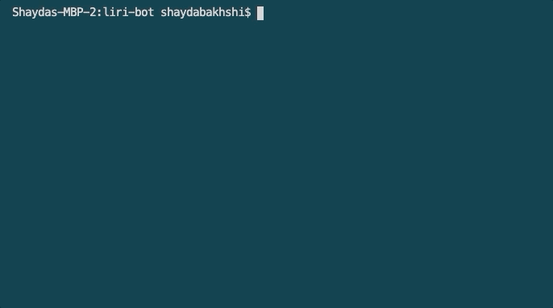
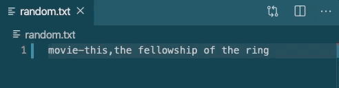

### Introduction

The Liri bot is a Siri-like application that allows the user to enter a query in the command line and receive data based on that query.

Liri can search Spotify, find nearby concerts, and give you information about movies.

## APP ORGANIZATION

This application uses the following node application and APIs to query data for the user:

* Node Spotify API
* Bands in Town API
* OMDB API

The application uses Axios to grab data from the APIs.

## HOW TO USE LIRI BOT

Liri is a simple command-line-based application that takes in a search parameter and search term entered by the user in a "do-this search term" format.

## EXAMPLES

All examples will run through the command line with node. Since our application is called liri.js, we will always initiate a command with the following:

                node liri.js

We'll then follow this with one of the following command plus a search term as follows in these examples:

***

### Search for song information
Command: spotify-this-song (song)

***

### Search for movie information
Command: movie-this (movie)

***

### Search for concert information
Command: concert-this (band)

***

### Read a file to search using the file presets
Command: do-what-it-says (NOTE: this doesn't require a search term, since the application will pull that value directly from the file)

In this example, we'll pull a command and search term from a file called random.txt. Here are the contents of that file:

As you'll see, the application uses this information to create a command and search term and gives us the information as though we'd typed it all out in the command line:

## DEFAULTS

